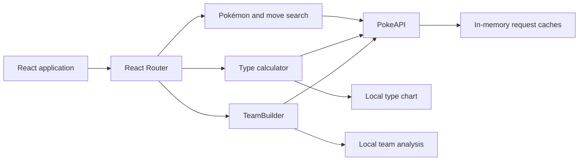

<p align="center">
  
</p>

# PokeApp

**A fast, Pokédex-inspired toolkit for exploring Pokémon, moves, type matchups, and team weaknesses.**

PokeApp combines searchable PokeAPI data with a local type-effectiveness engine and a six-slot TeamBuilder. It is designed as a responsive fan project with keyboard-accessible navigation, explicit loading and error states, and no account or backend requirement.

**[Open the live app](https://pokeapp.onrender.com/)** · [Search Pokémon](https://pokeapp.onrender.com/search) · [Build a team](https://pokeapp.onrender.com/teambuilder)

## Features

### Pokémon explorer

- Search by Pokémon name or National Pokédex number.
- View base stats, official artwork, typing, evolution chains, and level-up moves.
- Navigate directly to a Pokémon with routes such as [`/search/pikachu`](https://pokeapp.onrender.com/search/pikachu) or [`/search/25`](https://pokeapp.onrender.com/search/25).
- Handle punctuation, diacritics, spaces, and special names such as Nidoran♀, Nidoran♂, and Type: Null.
- Discover a rare shiny-artwork Easter egg.

### Move explorer

- Search moves with keyboard-accessible autocomplete.
- View type, damage class, power, accuracy, PP, priority, and effect text.
- Receive distinct inline feedback for invalid names, connectivity failures, rate limits, and PokeAPI outages.

### Type calculator

- Calculate defensive and offensive effectiveness for one or two types.
- Find every Pokémon matching the selected mono-type or dual-type combination.
- Use deterministic, complete type membership instead of random sampling.

### TeamBuilder

- Build a team of up to six unique Pokémon using name or Pokédex-number search.
- Get autocomplete suggestions and official artwork for every team member.
- Automatically compact the roster when a Pokémon is removed.
- Highlight shared weaknesses, uncovered threats, resistances, and immunities.
- Preserve concurrent additions and rapid removals without stale-request races.
- Respect reduced-motion preferences for roster animations.

TeamBuilder analysis currently uses **typing only**. Abilities, held items, moves, Terastallization, and format-specific rules are not included.

## Product qualities

- **Responsive:** Desktop, tablet, and narrow mobile layouts.
- **Keyboard accessible:** Focus-visible controls, labeled navigation, native interactive elements, and arrow-key autocomplete.
- **Screen-reader aware:** Combobox/listbox semantics, descriptive controls, status announcements, and focus-managed mobile navigation.
- **Resilient:** Retryable inline states distinguish not-found, network, rate-limit, server, and empty-result conditions.
- **Efficient:** Cached API requests, bounded move-detail concurrency, 20-move lazy batches, and deterministic type matching.

Accessibility has been considered throughout the current UI, but the project has not yet undergone a formal WCAG conformance audit.

## Architecture



PokeApp is a client-only single-page application:

- `src/Components/Search-Pokemon` owns Pokémon stats, evolutions, and version-aware moves.
- `src/Components/Search-Move` owns move search and move details.
- `src/Components/Type-Calculator` combines the local type chart with complete PokeAPI type membership.
- `src/Components/TeamBuilder` owns roster state, autocomplete, animations, and defensive analysis.
- `src/Components/Tools` contains shared navigation, error presentation, name normalization, and search controls.
- `public/_redirects` sends direct Render routes back to `index.html`.

There is no application server, database, authentication system, or service worker.

## Technology

| Area | Technology |
|---|---|
| UI | React 18, TypeScript 5, React Bootstrap, styled-components |
| Routing | React Router 6 |
| Data | Axios and [PokeAPI](https://pokeapi.co/) |
| Build | Vite 7 |
| Tests | Vitest, Testing Library, jsdom |
| CI | GitHub Actions on Ubuntu and Windows |
| Hosting | Render static site |

## Run locally

### Requirements

- Node.js 20.19 or newer (`.node-version` currently selects Node 20)
- Yarn 1.22.22

```bash
git clone https://github.com/TheRoro/PokeApp.git
cd PokeApp
yarn install
yarn dev
```

Open the local URL printed by Vite, normally <http://localhost:5173/>.

No environment variables or API keys are required.

## Commands

| Command | Purpose |
|---|---|
| `yarn dev` | Start the Vite development server |
| `yarn build` | Type-check and create the production bundle in `dist` |
| `yarn preview` | Serve the production bundle locally |
| `yarn test` | Run the test suite once |
| `yarn test:watch` | Run tests in watch mode |

Tests cover name normalization, move batching and concurrency, exhaustive type matching, TeamBuilder analysis and race conditions, route refreshes, autocomplete semantics, navigation accessibility, and inline API errors.

## Deployment

PokeApp is deployed as a **Render Static Site**.

| Render setting | Value |
|---|---|
| Root directory | Repository root |
| Build command | `yarn install --frozen-lockfile && yarn build` |
| Publish directory | `dist` |
| Node version | Read from `.node-version`, or set `NODE_VERSION=20.20.0` |

After migrating an existing Render service from Create React App, change the publish directory from `build` to `dist` and use **Clear build cache & deploy** once.

The SPA fallback in `public/_redirects` keeps direct routes and browser refreshes working:

```text
/*    /index.html   200
```

GitHub Actions installs the frozen lockfile, runs tests, and builds on both Ubuntu and Windows. Pull requests also run GitHub's dependency review.

## Privacy and data handling

PokeApp does not provide accounts, analytics, advertising, or an application backend. TeamBuilder state and API caches remain in browser memory and disappear when the page is reloaded.

Using the app sends requests from the browser to:

- [PokeAPI](https://pokeapi.co/) for Pokémon, move, species, evolution, and type data.
- The [PokeAPI sprites repository](https://github.com/PokeAPI/sprites) for some artwork and sprites.
- Google Fonts for the Plus Jakarta Sans font.

Searches included in the current route can appear in browser history. Refer to each external provider's policies for its handling of network requests.

## Browser support

PokeApp targets current evergreen releases of Chrome, Edge, Firefox, and Safari. JavaScript and network access are required. Internet Explorer and Opera Mini are not supported.

PokeApp intentionally does not install a service worker or claim offline support because its primary content depends on live PokeAPI data.

## Troubleshooting

### A Pokémon or move cannot be loaded

Check the spelling and network connection, then use the inline **Try again** action. PokeApp distinguishes missing resources from network, rate-limit, and PokeAPI server errors.

### A direct URL returns a Render 404

Confirm that `public/_redirects` is present in the deployed `dist` directory and that Render's publish directory is set to `dist`.

### Render uses the wrong Node.js version

Confirm `.node-version` exists at the configured root directory. Alternatively, add `NODE_VERSION=20.20.0` under the Render service's **Environment** settings.

### An old installed version behaves unexpectedly

PokeApp no longer uses a service worker and attempts to unregister its legacy worker automatically. If an old deployment remains cached, clear the site's browser data and reload once.

### The production build fails locally

Verify the active versions:

```bash
node --version
yarn --version
```

Then install the frozen dependency graph and rebuild:

```bash
yarn install --frozen-lockfile
yarn build
```

## Known limitations and roadmap

- Add route-specific metadata, canonical URLs, social cards, and a sitemap.
- Expand TeamBuilder with game-version rules, abilities, moves, offensive coverage, role warnings, and shareable team URLs.
- Add current product screenshots and formal performance and accessibility evidence.
- Continue tracking new Pokémon, forms, and mechanics as upstream data evolves.

## Attribution

Data is provided by [PokeAPI](https://pokeapi.co/), and some images are loaded from the [PokeAPI sprites project](https://github.com/PokeAPI/sprites).

Pokémon and Pokémon character names are trademarks of Nintendo, Creatures Inc., and GAME FREAK. PokeApp is an unofficial fan project and is not affiliated with or endorsed by those companies.

## License

This repository does not currently declare an open-source license. Contact [@TheRoro](https://github.com/TheRoro) before reusing or redistributing its source code.

---

Created by [@TheRoro](https://github.com/TheRoro).
